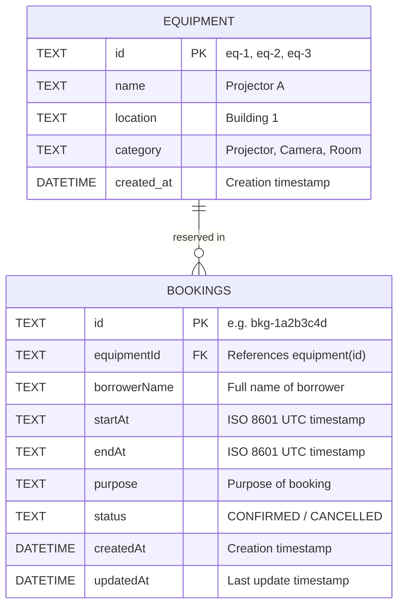

# Campus Equipment Booking API

**Course:** 2026_PlatformDev — Midterm Practical Lab Test  
**Stack:** TypeScript, Hono Framework, Cloudflare Workers, Cloudflare D1 (SQLite)  
**Base URL:** `http://localhost:8787` (supports both `/api` prefix and root routes)

---

## 1. Project Overview

A robust backend REST API for managing shared campus resources (e.g. projectors, cameras, meeting rooms) with conflict detection that prevents overlapping reservations for the same equipment.

### Features
* Complete CRUD operations on `/bookings` and read operations on `/equipment`.
* Time-overlap conflict prevention (`409 Conflict`).
* Input validation and chronological date checks (`400 Bad Request`).
* Resource lookup validation (`404 Not Found`).
* 100% Parameterized queries with D1 to prevent SQL Injection.
* Global CORS support for browser-based testing clients.

---

## 2. Data Model & ERD

### Entity-Relationship Diagram (ERD)



---

## 3. Getting Started & Run Instructions

### Prerequisites
* Node.js (v20+ recommended)
* npm

### Installation
```bash
npm install
```

### Initialize Local D1 Database
Create the SQLite tables and seed data locally:
```bash
npm run db:init:local
```

### Start Local Development Server
```bash
npm run dev
```
The server will start listening at: `http://localhost:8787`

### Optional: Cloudflare Remote Deployment
To deploy to your Cloudflare account:
```bash
# 1. Create a remote D1 database (one-time setup):
npx wrangler d1 create equipment-db

# 2. Update database_id in wrangler.jsonc with the generated ID

# 3. Apply schema to remote D1:
npm run db:init:remote

# 4. Deploy worker:
npm run deploy
```

---

## 4. API Endpoints & Contract Summary

Detailed specification available in [`API_CONTRACT.md`](API_CONTRACT.md).

| Method | Path | Status | Purpose |
|---|---|---:|---|
| `GET` | `/equipment` (or `/api/equipment`) | 200 | List all equipment |
| `GET` | `/bookings` (or `/api/bookings`) | 200 | List all bookings |
| `GET` | `/bookings/:id` (or `/api/bookings/:id`) | 200 / 404 | Get single booking |
| `POST` | `/bookings` (or `/api/bookings`) | 201 / 400 / 409 | Create new booking |
| `PATCH` | `/bookings/:id` (or `/api/bookings/:id`) | 200 / 400 / 404 / 409 | Update booking |
| `DELETE`| `/bookings/:id` (or `/api/bookings/:id`) | 204 / 404 | Delete booking |

All error responses strictly follow:
```json
{ "error": "A message understandable to a user or developer" }
```

---

## 5. Verification Evidence (Recorded Test Cases)

Tested with `BASE_URL="http://127.0.0.1:8787"`.

### Case 1: List Equipment (Success: 200 OK)
* **Command:**
  ```bash
  curl -i http://127.0.0.1:8787/api/equipment
  ```
* **Response:**
  ```http
  HTTP/1.1 200 OK
  Content-Type: application/json
  Access-Control-Allow-Origin: *

  [
    {"id":"eq-1","name":"Projector A","location":"Building 1"},
    {"id":"eq-2","name":"Sony Alpha 7 IV Camera","location":"Media Center, Room 204"},
    {"id":"eq-3","name":"Meeting Room 301","location":"Building 3, 3rd Floor"}
  ]
  ```

---

### Case 2: Create Booking (Success: 201 Created)
* **Command:**
  ```bash
  curl -i -X POST http://127.0.0.1:8787/api/bookings \
    -H "Content-Type: application/json" \
    -d "{\"equipmentId\":\"eq-1\",\"borrowerName\":\"Somchai Jaidee\",\"startAt\":\"2026-10-20T09:00:00.000Z\",\"endAt\":\"2026-10-20T11:00:00.000Z\",\"purpose\":\"Class presentation\"}"
  ```
* **Response:**
  ```http
  HTTP/1.1 201 Created
  Content-Type: application/json
  Access-Control-Allow-Origin: *

  {
    "id": "bkg-1a6d6666",
    "equipmentId": "eq-1",
    "borrowerName": "Somchai Jaidee",
    "startAt": "2026-10-20T09:00:00.000Z",
    "endAt": "2026-10-20T11:00:00.000Z",
    "purpose": "Class presentation",
    "status": "CONFIRMED",
    "createdAt": "2026-10-06T06:38:48.630Z",
    "updatedAt": "2026-10-06T06:38:48.630Z"
  }
  ```

---

### Case 3: Create Overlapping Booking (Conflict: 409 Conflict)
* **Command:**
  ```bash
  curl -i -X POST http://127.0.0.1:8787/api/bookings \
    -H "Content-Type: application/json" \
    -d "{\"equipmentId\":\"eq-1\",\"borrowerName\":\"Somsak\",\"startAt\":\"2026-10-20T10:00:00.000Z\",\"endAt\":\"2026-10-20T12:00:00.000Z\",\"purpose\":\"Overlapping meeting\"}"
  ```
* **Response:**
  ```http
  HTTP/1.1 409 Conflict
  Content-Type: application/json
  Access-Control-Allow-Origin: *

  {"error":"Equipment 'eq-1' is already booked from 2026-10-20T09:00:00.000Z to 2026-10-20T11:00:00.000Z"}
  ```

---

### Case 4: Invalid Chronological Times (Validation: 400 Bad Request)
* **Command:**
  ```bash
  curl -i -X POST http://127.0.0.1:8787/api/bookings \
    -H "Content-Type: application/json" \
    -d "{\"equipmentId\":\"eq-1\",\"borrowerName\":\"Somsak\",\"startAt\":\"2026-10-20T15:00:00.000Z\",\"endAt\":\"2026-10-20T14:00:00.000Z\",\"purpose\":\"Invalid chronological time\"}"
  ```
* **Response:**
  ```http
  HTTP/1.1 400 Bad Request
  Content-Type: application/json
  Access-Control-Allow-Origin: *

  {"error":"startAt must be strictly earlier than endAt"}
  ```

---

### Case 5: Non-existent Equipment ID (Validation: 400 Bad Request)
* **Command:**
  ```bash
  curl -i -X POST http://127.0.0.1:8787/api/bookings \
    -H "Content-Type: application/json" \
    -d "{\"equipmentId\":\"eq-999\",\"borrowerName\":\"Somsak\",\"startAt\":\"2026-10-20T10:00:00.000Z\",\"endAt\":\"2026-10-20T12:00:00.000Z\",\"purpose\":\"Testing equipment non-exist\"}"
  ```
* **Response:**
  ```http
  HTTP/1.1 400 Bad Request
  Content-Type: application/json
  Access-Control-Allow-Origin: *

  {"error":"Equipment with ID 'eq-999' does not exist"}
  ```

---

### Case 6: Update Booking (Success: 200 OK)
* **Command:**
  ```bash
  curl -i -X PATCH http://127.0.0.1:8787/api/bookings/bkg-1a6d6666 \
    -H "Content-Type: application/json" \
    -d "{\"purpose\":\"Updated: Final presentation\"}"
  ```
* **Response:**
  ```http
  HTTP/1.1 200 OK
  Content-Type: application/json
  Access-Control-Allow-Origin: *

  {
    "id": "bkg-1a6d6666",
    "equipmentId": "eq-1",
    "borrowerName": "Somchai Jaidee",
    "startAt": "2026-10-20T09:00:00.000Z",
    "endAt": "2026-10-20T11:00:00.000Z",
    "purpose": "Updated: Final presentation",
    "status": "CONFIRMED",
    "createdAt": "2026-10-06T06:38:48.630Z",
    "updatedAt": "2026-10-06T06:41:12.942Z"
  }
  ```

---

### Case 7: Delete Booking (Success: 204 No Content)
* **Command:**
  ```bash
  curl -i -X DELETE http://127.0.0.1:8787/api/bookings/bkg-1a6d6666
  ```
* **Response:**
  ```http
  HTTP/1.1 204 No Content
  Access-Control-Allow-Origin: *
  ```

---

### Case 8: Fetch Deleted Resource (Not Found: 404 Not Found)
* **Command:**
  ```bash
  curl -i http://127.0.0.1:8787/api/bookings/bkg-1a6d6666
  ```
* **Response:**
  ```http
  HTTP/1.1 404 Not Found
  Content-Type: application/json
  Access-Control-Allow-Origin: *

  {"error":"Booking with ID 'bkg-1a6d6666' not found"}
  ```

---

## 6. Associated Documentation
* [`API_CONTRACT.md`](API_CONTRACT.md) — Complete REST specification and schema rules.
* [`AI_LOG.md`](AI_LOG.md) — Log of AI interactions, prompts, modifications, and verifications.
* [`QUALITY_GATE_REVIEW.md`](QUALITY_GATE_REVIEW.md) — 30-minute Quality Gate audit, findings, fixes, and evidence.
